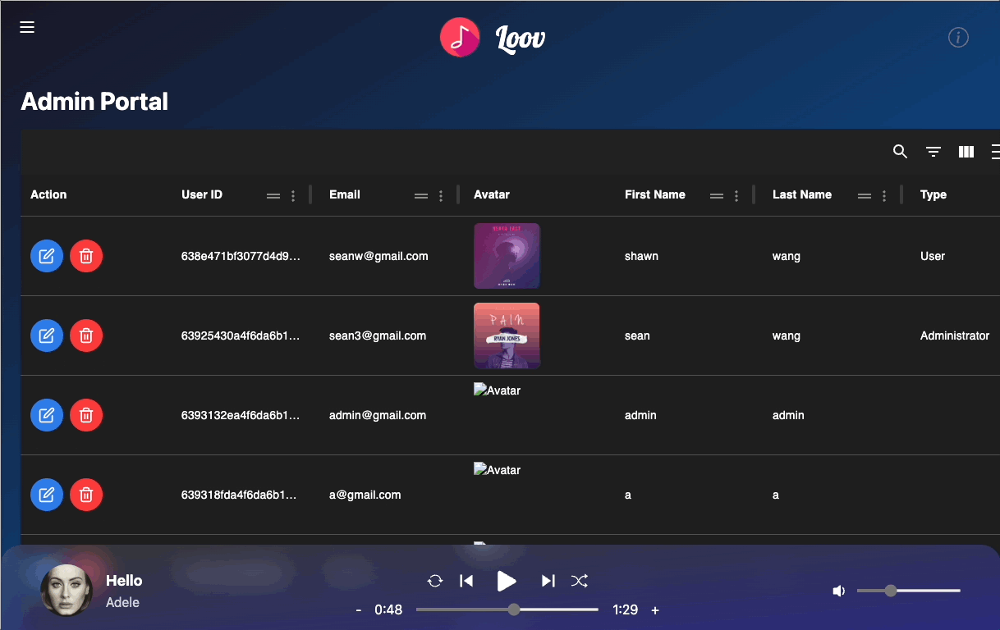

#    

# Loov - A Cloud Music Library

## Introduction
Loov will collect your favorite songs, artist and playlists conveniently at just one click. Discover trendy music, artists, lyrics, & playlists, all for free. Music discovering services are empowered by Shazam and Apple music.
WHY YOU’LL LOVE IT

Find the name of any song or artist in seconds. Play the demo and add to your favorite collection and playlists at one click. Follow along with song lyrics, enjoy related music and top songs of an artist at detail pages. Expand player bar, switch between coverart and lyrics of the actively playing song.

LOOV ANYWHERE, AT ANY TIME

Get it ready on a desktop browser, Android Chrome or iPhone Safari. Interactive and responsive app design in nature. Smooth transition and accomodation to various window sizes. One login enables you to access your favorite collections right away wherever you are.

By Sean Zhenyu Wang
Dec 10 2022

## Technologies
[Frontend](https://github.com/Sespeck/loov-client): React.js, Tailwind CSS, Redux state management, Shazam Core API

[Backend](https://github.com/Sespeck/loov-server): Express Server, MongoDB Atlas, Mongoose

## Navigation Graph

## Data Model

## Screenshots

#### 1. Sign Up

#### 2. Login

#### 3. Home page without login for anonymous users

#### 4. Home page for logged-in users

#### 5. Top Charts

#### 6. Top Artists

#### 7. Yours - recently played songs, favorite songs, artists, playlists

#### 8. Edit playlist

#### 9. New and delete playlist

#### 10. Search

#### 11. Profile

#### 12. Admin - edit user

#### 13. Admin - delete user

#### 14. Update song in playlist

#### 15. Sign out
